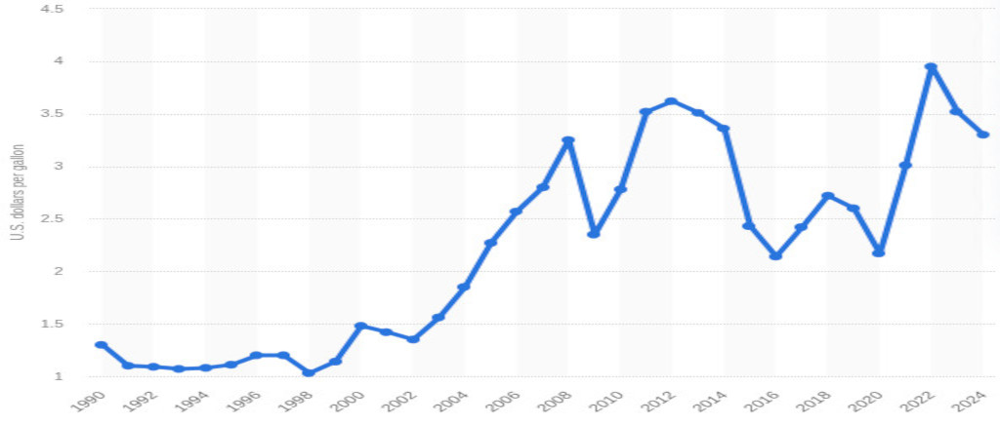

# Agrimer

Agrimer is a php lib to grab food market's quotations for both french and german market place.

## FranceAgrimer

FranceAgrimer is the data provider but it publishes quotations as html format only, no api available to deal with raw datas.

## History

### FAO price index

Over last 35 years


### USA gasoline price

Over last 35 years



### Climate temperature changes

Over last 140 years


### Relevance

* Food market's quotations are relevant indices to reveal global economic health.
* Feed 8 billion people is the challenge.
* Production tool cost is strongly corelated to fossil energy price because of large culture scale strategy.
* Efforts due to climate change require more energy according various factors (soil health input ,plow ,cryptogamous disease treatments ,loss of bacteria from the biotope).

## Setup

```bash
git clone https://github.com/pierre-fromager/Agrimer.git
cd Agrimer
composer install
```

Or you can also install it from packagist

```bash
composer require pier-infor/agrimer
```

## Example

You can run a simple use case to start to use this lib running :

```bash
composer start
```

Source file is index.php

## Licence

The source is published as GNU-GPL3.

Feel free to use, modify, contrib.

